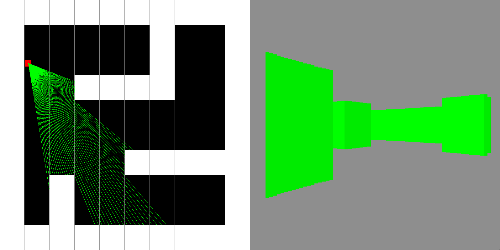

# Raycaster

Simple raycaster written in C++ 20 with SDL2 for graphics.

### Build

1. Get yourself a `C++ 20` Compiler
2. Install `CMake`
3. Link SDL2 library with CMake variable `-DCMAKE_TOOLCHAIN_FILE`

